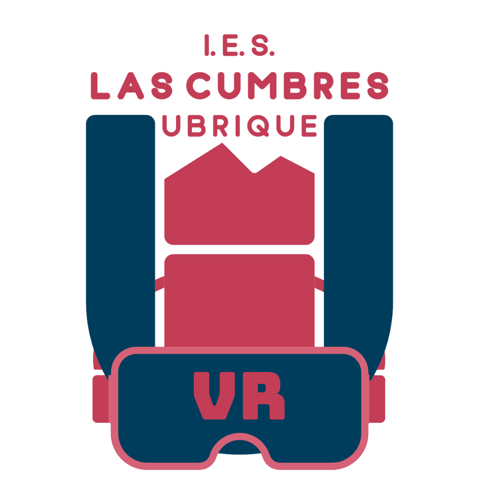
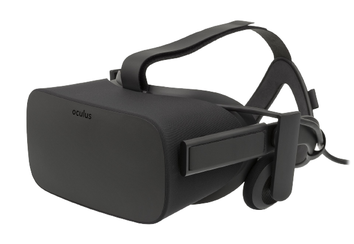
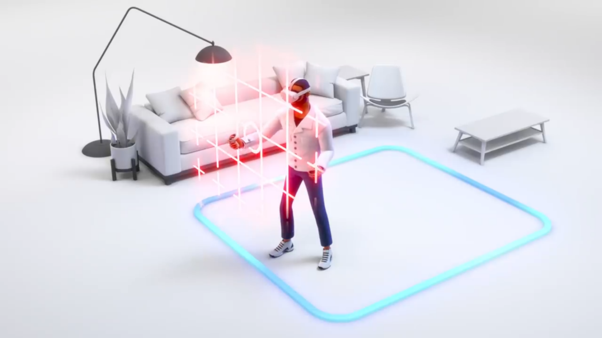
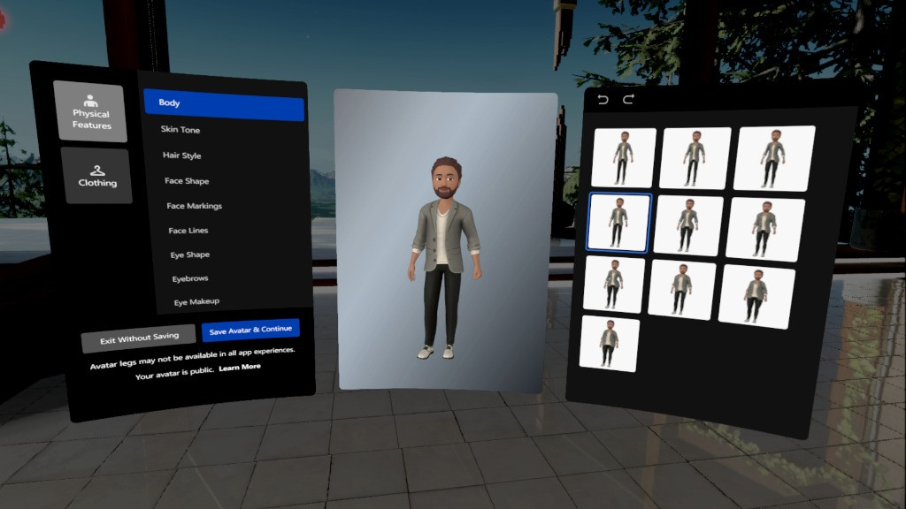
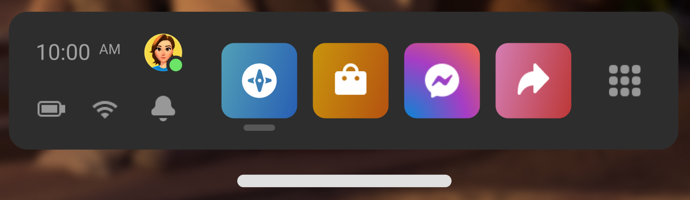
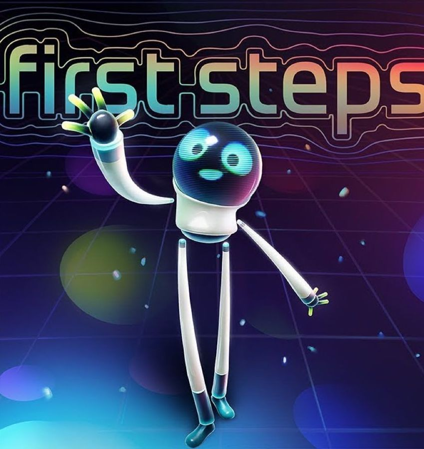
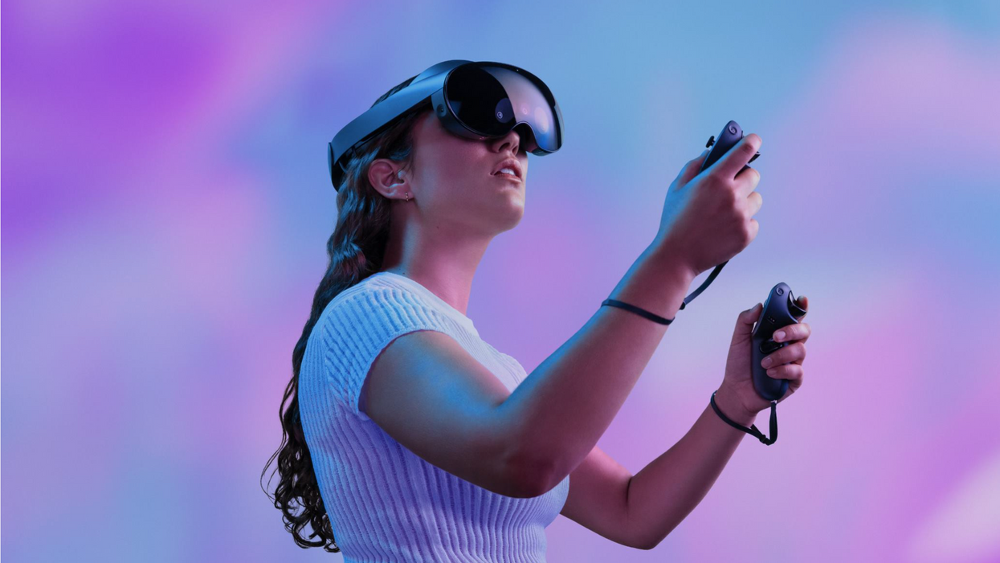

---
## Realidad Virtual en el IES Las Cumbres
---
## Un poco de contexto

Oculus fundada por Palmer Luckey en 2012

Oculus Rift necesitaba un ordenador

Adquirida por Facebook (Meta) en 2014

Versión standalone en 2017 (Oculus Go)

Oculus Quest (2018) → Oculus Quest 2 (2020) → Meta Quest 2 (2021)

---

## Hardware de Meta Quest 2

**Pantalla**: 1 * 1832×3800 (1832×1920 por ojo) LCD

**Tasa de refresco**: 72-90Hz (120Hz en fase experimental)

**Tienda**: Oculus Quest Store (posibilidad de usar Oculus Link)

**Procesador**: SOC Snapdragon XR2

**RAM**: 6GB

**Almacenamiento**: 128GB (de 350€ a 450€) / 256GB (de 450€ a 550€)

**Peso**: 503g

**Mandos**: 2 * Oculus Touch Controller (V3)

**Batería**: 2-3 horas
---

## Echa un vistazo

 <iframe title="Quest 2 Headset - FanArt" frameborder="0" allowfullscreen mozallowfullscreen="true" webkitallowfullscreen="true" allow="autoplay; fullscreen; xr-spatial-tracking" xr-spatial-tracking execution-while-out-of-viewport execution-while-not-rendered web-share width="640" height="480" src="https://sketchfab.com/models/ee496aa030bf4f37a52b445196796af3/embed?autostart=1"> </iframe> 

---
## Seguridad

**Sistema guardián**: límite fijo o con desplazamiento

Abrazaderas y ajuste del casco

Experimental: Percepción sensorial

Posibilidad de mareo → Importancia del uso incremental

---
## Gestión de cuentas

Cuenta hasta hace poco asociada a Facebook

Avatar asociado a la cuenta

Posibilidad de multicuenta

Gestión desde app

---
## Oculus Home

---
## Lanza la primera aplicación

---
## Soporte educativo

Control por transmisión en la app (1,4,3,2)

Posibilidad de grabación en realidad virtual

Múltiples recursos para diferentes materias

Y lo mejor está por llegar...

## ¿Cuándo usar VR en educación?

Falta de material (caro o escaso).

Hay modelos o conceptos más fácil de comprender en tres dimensiones.

Cambio de escala: universo, cuerpo humano, metáforas de dispositivos.

Localizaciones remotas.

Actividades peligrosas.

Actividad manual que requiere pasos muy precisos.

Ambiente controlado para replicar acciones de forma individual.

## Creación de experiencias educativas

Educa360

Zoe

Ausencia de soluciones libres

## Idiomas

[Mondly: Learn Languages in VR](https://www.oculus.com/experiences/quest/4214902388537196/?locale=es_ES)

Intercambios virtuales: [Horizon Venues](https://www.oculus.com/experiences/quest/3002729676463989/?locale=es_ES)

[ImmerseMe](https://immerseme.co)

## Música

[Virtuoso](https://www.oculus.com/experiences/quest/4705981139481778)

[Grand Reality](https://grandreality.app)

[MelodyVR](https://www.oculus.com/experiences/quest/2617356444966011?ranking_trace=0_2617356444966011_QUESTSEARCH_7f06bc06-0c45-468a-891d-0ddf4356691a)

## Biología y Geología

[ecosphere](https://www.oculus.com/experiences/quest/2926036530794417?ranking_trace=0_2926036530794417_QUESTSEARCH_021646a7-849a-4599-9485-e3773070836e)

[High School Anatomy for Quest](https://www.oculus.com/experiences/quest/5556243174447482/)

[CPR](https://www.oculus.com/experiences/quest/5320252051348244/?utm_source=sidequest)

## Administrativo

[Horizon Workrooms](https://www.oculus.com/experiences/quest/2514011888645651/)

[ShapesXR](https://www.oculus.com/experiences/quest/3899112273551602/)

[Job Simulator](https://www.oculus.com/experiences/quest/3235570703151406/?locale=es_ES)

## Informática

Videojuegos serios: [Crear experiencias educativas](https://www.zoe.com/software/zoe-for-unity/)

Web: [A-Frame](https://aframe.io)

[Desarrollo](https://developer.oculus.com/get-started-platform/)

## Física y Química

[Molecule Builder](https://www.oculus.com/experiences/quest/3632813843496339/?utm_medium=share&utm_source=oculus)

[Faraday´s Magnets VR](https://sidequestvr.com/app/591/faradays-magnets)

[Nanome](https://www.oculus.com/experiences/rift/1873145426039242/)

## Ciencias

[Titans of Space +](https://www.oculus.com/experiences/quest/2359857214088490/?locale=es_ES)

[Mission:ISS](https://www.oculus.com/experiences/quest/2094303753986147/?locale=es_ES)

[National Geographic Explore VR](https://www.oculus.com/experiences/quest/2046607608728563)

## Matemáticas

[Pandemic by Prisms](https://www.oculus.com/experiences/quest/3079043625531665/?utm_source=oculusapplab.com)

[Carroll´s Riddles](https://sidequestvr.com/app/574/carrolls-riddles)

[Number Cruncher](https://sidequestvr.com/app/6642/number-cruncher)

[XR-Graph](https://xr-graph.vercel.app)

## Tecnología

[Gadgeteer](https://www.oculus.com/experiences/quest/2567395559960697)

[Adam Savage's Tested VR](https://www.oculus.com/experiences/quest/2586839431358655/)

[Gravity Sketch](https://www.oculus.com/experiences/quest/1587090851394426/)

## Formación y Orientación Laboral

[VirtualSpeech](https://www.oculus.com/experiences/quest/3973230756042512/?locale=es_ES)

[Spatial](https://www.oculus.com/experiences/quest/2927141310670477)

[Bodyswaps](https://www.oculus.com/experiences/quest/3714188128706579/?utm_source=oculusapplab.com)

## Lengua y Literatura

[Anne Frank House VR](https://www.oculus.com/experiences/quest/1958100334295482?ranking_trace=0_1958100334295482_QUESTSEARCH_5beb6ad8-cbb7-4fe9-a2e5-6d0a0156b087)

[Keep Talking and Nobody Explodes](https://www.oculus.com/experiences/quest/2010043642376517?ranking_trace=0_2010043642376517_QUESTSEARCH_4f1ae067-7a52-4c06-bd63-65beb252b950)

[Rutas de Don Quijote (La Mancha VR)](https://www.youtube.com/watch?v=uBIZwFD8mH8)

## Geografía e Historia

[Wander](https://www.oculus.com/experiences/quest/2078376005587859/?locale=es_ES)

[Tours virtuales](https://my.matterport.com/show/?m=d42fuVA21To)

[Google Earth VR](https://arvr.google.com/earth/)

## Comercio y Marketing

Aplican aplicaciones de los apartados de Idiomas y Administrativo

[Crop Craze: Farming Simulator](https://www.oculus.com/experiences/quest/5617270104965437/?utm_source=sidequest)

[El cambio en la industria](https://business.trustedshops.es/blog/ejemplos-realidad-aumentada-realidad-virtual-estrategia-marketing/)

[Analítica VR en los comercios](https://cognitive3d.com/retail/)

## Servicios sociales y a la comunidad

[ZenVR](https://sidequestvr.com/app/5026/zenvr)

[Imercyve: Living with Intellectual Disability](https://sidequestvr.com/app/1902/imercyve-living-with-intellectual-disability)

[Sea Level Rise Explorer: Long Beach](https://sidequestvr.com/app/3784/sea-level-rise-explorer-long-beach)

[Everyday Inclusion - An Interactive Learning Journey About Unconscious Bias](https://sidequestvr.com/app/1262/everyday-inclusion-an-interactive-learning-journey-about-unconscious-bias)

## Más sobre educación

[Enlace a la tienda oficial](https://www.oculus.com/experiences/quest/)

Existen más alternativas: [App Lab](https://applabgamelist.com/Best)

Experiencias en la web: [Access Mars](https://experiments.withgoogle.com/access-mars), [Speak to Go](https://experiments.withgoogle.com/speak-to-go), 

Una gran cantidad de vídeos en 360: [Viaje al interior del cuerpo humano](https://www.youtube.com/watch?v=d9D5csXovEM), [Tour por Londres](https://www.youtube.com/watch?v=m9EClKA1VeQ)

[Y esto solo acaba de empezar](https://www.desconsolados.com/2021/07/17/visita-albarracin-de-manera-virtual-gracias-a-vr-chat/)
---
## Actualidad

## Meta Quest Pro

Presentado en octubre

Modo passthrough en color

Capacidad para transmitir emociones

Mandos mejorados

Enfoque profesional

Su precio es 1800€
---
## Objetivos a alcanzar

Futuro del trabajo

Futuro del ocio

Futuro del deporte

Futuro de la educación
---

<!-- .slide: data-background-video="../assets/vr.mp4" data-background-opacity="0.6" data-background-video-loop data-background-video-muted -->

## ¿Dudas?